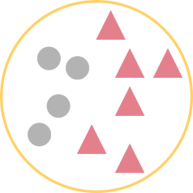
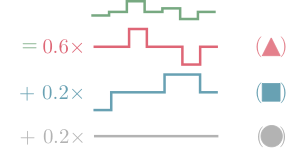
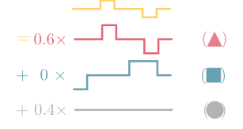

## Introduction

This document provides a brief tutorial on using the InCaSCN package, which implements a constraint dictionary learning problem to recover subclones across several patients with SNP data. The InCaSCN model is designed to identify regions of copy number variation (CNV) in multi-sample SNPs data. In particular, it takes advantage of any
similarities shared among samples while maintaining the ability to identify any potential heterogeneity by using parental copy number signals. The model is decribed in details below

## Model 

The figure below illustrates the model used in the InCaS-CN package. Two heterogeneous tumor samples (green and yellow circles) are composed of a collection of normal cells (gray discs) and two cancer subclones (red triangles and blue squares). One of the cancer subclones is present in both tumor samples. 




The corresponding (noiseless) copy number profiles are displayed in the figure below. They are given by a linear combination of the latent profiles. This Figure is adapted from \cite{nowak2011fused}. [REF]





## Using the package
```{r, echo=F, message=FALSE,warning=FALSE}
library("InCaSCN")
library("ggplot2")

set.seed(10)
```

### Creating a synthetic data set

We start by defining the characteristics of the subclone profiles: length, number of subclones, breakpoint positions, and copy number states:

```{r}
len <- 500*10
nbClones <- 3
bkps <- list(c(100,250)*10, c(150,400)*10,c(150,400)*10)
regions <-list(c("(0,1)", "(0,2)","(1,2)"), c("(1,1)", "(0,1)","(1,1)"), c("(0,2)", "(0,1)","(1,1)"))
```

Then, we load an annotated data set from the `acnr` package [REF].  The `buildSubclones` function can then be used to generate the subclone profiles with the above characteristics, by resampling from the annotated data set.

```{r}
dataAnnotTP <- loadCnRegionData(dataSet="GSE11976", tumorFrac=1)
dataAnnotN <- loadCnRegionData(dataSet="GSE11976", tumorFrac=0)
datSubClone <- buildSubclones(len, dataAnnotTP, dataAnnotN, nbClones, bkps, regions)
```
 
The same can be done using another data set from the `acnr` package:

 
```{r}
dataAnnotTP <- loadCnRegionData(dataSet="GSE13372", tumorFraction=1)
dataAnnotN <- loadCnRegionData(dataSet="GSE13372", tumorFraction=0)
datSubClone2 <- buildSubclones(len, dataAnnotTP, dataAnnotN, nbClones, bkps, regions)
```

```{r, echo=FALSE}
cols <- c("#00000033", "#FD6C9E33", "#00000033")
plot(datSubClone[[1]]$ct, col=cols[factor(datSubClone[[1]]$genotype)], cex=0.3, pch=19, ylab="TCN",ylim=c(0,4))
plot(datSubClone2[[1]]$ct, col=cols[factor(datSubClone2[[1]]$genotype)], cex=0.3, pch=19, ylab="TCN",ylim=c(0,4))
plot(datSubClone[[1]]$baft, col=cols[factor(datSubClone[[1]]$genotype)], cex=0.3, pch=19, ylab="BAF",ylim=c(-0.1,1.1))
plot(datSubClone2[[1]]$baft, col=cols[factor(datSubClone2[[1]]$genotype)], cex=0.3, pch=19, ylab="BAF",ylim=c(-0.1,1.1))
```

Once subclones are created, we can generate a matrix $W$ in order to build mixtures.

```{r, warning=FALSE, cache=FALSE}
W = getWeightMatrix(70,30, nb.arch = 3, nb.samp = 20)
dat <- apply(W, 1, mixSubclones, subClones=datSubClone, fracN=NULL)
str(dat[[1]])
```

Note that dat is a list of data frame with the following necessary columns : ```c1,c2,tcn,dh,genotype```

### Run InCaSCN model

Then the InCaSCN method can be appluied to the mixture data set. Let us choose the same grid for $\lambda_1$ and $\lambda_2$ and a grid from 2 to 6 for the number of subclones.

```{r INCASCN, warning=FALSE}
lambda1.grid <- lambda2.grid <- c(0.005,0.001)
casRes <- InCaSCN(dat,lambda1.grid, lambda2.grid, nb.arch.grid = 2:6)
casResTCN <- InCaSCN(dat,lambda1.grid, lambda2.grid, nb.arch.grid = 2:6, stat="TCN")
```

For each $p$ ```InCaSCN``` keep only the combination $(\lambda_1, \lambda_2)$ which minimize the BIC. The next step is to choose the best $p$ (number of subclones). In this example, it seems that the best is $\hat{p}=4$ (which is the true number of subclones).

```{r, echo=FALSE}
result.pve <- sapply(casRes, function(cc) cc$PVE)
dataPVE <- data.frame(nb.subclones=sapply(casRes, function(cc) cc$param$nb.arch), pve=result.pve)
ggplot(dataPVE)+geom_line(aes(nb.subclones, pve))+geom_point(aes(nb.subclones, pve))+xlab("Number of subclones")+ylab("PVE")+ylim(c(0.8,1))+theme_bw()
```
```{r, echo=FALSE}
result.pveTCN <- sapply(casResTCN, function(cc) cc$PVE)
dataPVETCN <- data.frame(nb.subclones=sapply(casResTCN, function(cc) cc$param$nb.arch), pve=result.pveTCN)
ggplot(dataPVETCN)+geom_line(aes(nb.subclones, pve))+geom_point(aes(nb.subclones, pve))+xlab("Number of subclones")+ylab("PVE")+ylim(c(0.8,1))+theme_bw()
```

We can compare the true and the estimated matrices of the weights. Even if the computation is not perfect, we can easily recover a classification close to the truth with the inferred weight matrix. 

```{r, echo=FALSE}
## trim.heatmap
trim.heatmap <- function(data,trim){
## 	data <- data - mean(data, na.rm = TRUE)
 	data = t(scale(t(data)))
	q <- quantile(data, c((1 - trim), trim), na.rm = TRUE)
	data[data < q[1]] = q[1]
	data[data > q[2]] = q[2]
	maxi <- max(data, na.rm = TRUE)
	mini <- min(data, na.rm = TRUE)
	data[!is.na(data) & data > 0] <- data[!is.na(data) &  data > 0]/maxi
	data[!is.na(data) & data < 0] <- -data[!is.na(data) &  data < 0]/mini
	return(data)
}


heatmap.3 <- function(x,
                      Rowv = TRUE, Colv = if (symm) "Rowv" else TRUE,
                      distfun = dist,
                      hclustfun = hclust,
                      dendrogram = c("both","row", "column", "none"),
                      symm = FALSE,
                      scale = c("none","row", "column"),
                      na.rm = TRUE,
                      revC = identical(Colv,"Rowv"),
                      add.expr,
                      breaks,
                      symbreaks = max(x < 0, na.rm = TRUE) || scale != "none",
                      col = "heat.colors",
                      colsep,
                      rowsep,
                      sepcolor = "white",
                      sepwidth = c(0.05, 0.05),
                      cellnote,
                      notecex = 1,
                      notecol = "cyan",
                      na.color = par("bg"),
                      trace = c("none", "column","row", "both"),
                      tracecol = "cyan",
                      hline = median(breaks),
                      vline = median(breaks),
                      linecol = tracecol,
                      margins = c(5,5),
                      ColSideColors,
                      RowSideColors,
                      side.height.fraction=0.3,
                      cexRow = 0.2 + 1/log10(nr),
                      cexCol = 0.2 + 1/log10(nc),
                      cexMain = 1.5, ## add me
                      cexKey=1, ## add me
                      cexColorKey=1, ## add me
                      labRow = NULL,
                      labCol = NULL,
                      key = TRUE,
                      keysize = 1.5,
                      density.info = c("none", "histogram", "density"),
                      denscol = tracecol,
                      symkey = max(x < 0, na.rm = TRUE) || symbreaks,
                      densadj = 0.25,
                      main = NULL,
                      xlab = NULL,
                      ylab = NULL,
                      lmat = NULL,
                      lhei = NULL,
                      lwid = NULL,
                      ColSideColorsSize = 1,
                      RowSideColorsSize = 1,
                      KeyValueName="Value",...){
 
    invalid <- function (x) {
      if (missing(x) || is.null(x) || length(x) == 0)
          return(TRUE)
      if (is.list(x))
          return(all(sapply(x, invalid)))
      else if (is.vector(x))
          return(all(is.na(x)))
      else return(FALSE)
    }
 
    x <- as.matrix(x)
    scale01 <- function(x, low = min(x), high = max(x)) {
        x <- (x - low)/(high - low)
        x
    }
    retval <- list()
    scale <- if (symm && missing(scale))
        "none"
    else match.arg(scale)
    dendrogram <- match.arg(dendrogram)
    trace <- match.arg(trace)
    density.info <- match.arg(density.info)
    if (length(col) == 1 && is.character(col))
        col <- get(col, mode = "function")
    if (!missing(breaks) && (scale != "none"))
        warning("Using scale=\"row\" or scale=\"column\" when breaks are",
            "specified can produce unpredictable results.", "Please consider using only one or the other.")
    if (is.null(Rowv) || is.na(Rowv))
        Rowv <- FALSE
    if (is.null(Colv) || is.na(Colv))
        Colv <- FALSE
    else if (Colv == "Rowv" && !isTRUE(Rowv))
        Colv <- FALSE
    if (length(di <- dim(x)) != 2 || !is.numeric(x))
        stop("`x' must be a numeric matrix")
    nr <- di[1]
    nc <- di[2]
    if (nr <= 1 || nc <= 1)
        stop("`x' must have at least 2 rows and 2 columns")
    if (!is.numeric(margins) || length(margins) != 2)
        stop("`margins' must be a numeric vector of length 2")
    if (missing(cellnote))
        cellnote <- matrix("", ncol = ncol(x), nrow = nrow(x))
    if (!inherits(Rowv, "dendrogram")) {
        if (((!isTRUE(Rowv)) || (is.null(Rowv))) && (dendrogram %in%
            c("both", "row"))) {
            if (is.logical(Colv) && (Colv))
                dendrogram <- "column"
            else dedrogram <- "none"
            warning("Discrepancy: Rowv is FALSE, while dendrogram is `",
                dendrogram, "'. Omitting row dendogram.")
        }
    }
    if (!inherits(Colv, "dendrogram")) {
        if (((!isTRUE(Colv)) || (is.null(Colv))) && (dendrogram %in%
            c("both", "column"))) {
            if (is.logical(Rowv) && (Rowv))
                dendrogram <- "row"
            else dendrogram <- "none"
            warning("Discrepancy: Colv is FALSE, while dendrogram is `",
                dendrogram, "'. Omitting column dendogram.")
        }
    }
    if (inherits(Rowv, "dendrogram")) {
        ddr <- Rowv
        rowInd <- order.dendrogram(ddr)
    }
    else if (is.integer(Rowv)) {
        hcr <- hclustfun(distfun(x))
        ddr <- as.dendrogram(hcr)
        ddr <- reorder(ddr, Rowv)
        rowInd <- order.dendrogram(ddr)
        if (nr != length(rowInd))
            stop("row dendrogram ordering gave index of wrong length")
    }
    else if (isTRUE(Rowv)) {
        Rowv <- rowMeans(x, na.rm = na.rm)
        hcr <- hclustfun(distfun(x))
        ddr <- as.dendrogram(hcr)
        ddr <- reorder(ddr, Rowv)
        rowInd <- order.dendrogram(ddr)
        if (nr != length(rowInd))
            stop("row dendrogram ordering gave index of wrong length")
    }
    else {
        rowInd <- nr:1
    }
    if (inherits(Colv, "dendrogram")) {
        ddc <- Colv
        colInd <- order.dendrogram(ddc)
    }
    else if (identical(Colv, "Rowv")) {
        if (nr != nc)
            stop("Colv = \"Rowv\" but nrow(x) != ncol(x)")
        if (exists("ddr")) {
            ddc <- ddr
            colInd <- order.dendrogram(ddc)
        }
        else colInd <- rowInd
    }
    else if (is.integer(Colv)) {
        hcc <- hclustfun(distfun(if (symm)
            x
        else t(x)))
        ddc <- as.dendrogram(hcc)
        ddc <- reorder(ddc, Colv)
        colInd <- order.dendrogram(ddc)
        if (nc != length(colInd))
            stop("column dendrogram ordering gave index of wrong length")
    }
    else if (isTRUE(Colv)) {
        Colv <- colMeans(x, na.rm = na.rm)
        hcc <- hclustfun(distfun(if (symm)
            x
        else t(x)))
        ddc <- as.dendrogram(hcc)
        ddc <- reorder(ddc, Colv)
        colInd <- order.dendrogram(ddc)
        if (nc != length(colInd))
            stop("column dendrogram ordering gave index of wrong length")
    }
    else {
        colInd <- 1:nc
    }
    retval$rowInd <- rowInd
    retval$colInd <- colInd
    retval$call <- match.call()
    x <- x[rowInd, colInd]
    x.unscaled <- x
    cellnote <- cellnote[rowInd, colInd]
    if (is.null(labRow))
        labRow <- if (is.null(rownames(x)))
            (1:nr)[rowInd]
        else rownames(x)
    else labRow <- labRow[rowInd]
    if (is.null(labCol))
        labCol <- if (is.null(colnames(x)))
            (1:nc)[colInd]
        else colnames(x)
    else labCol <- labCol[colInd]
    if (scale == "row") {
        retval$rowMeans <- rm <- rowMeans(x, na.rm = na.rm)
        x <- sweep(x, 1, rm)
        retval$rowSDs <- sx <- apply(x, 1, sd, na.rm = na.rm)
        x <- sweep(x, 1, sx, "/")
    }
    else if (scale == "column") {
        retval$colMeans <- rm <- colMeans(x, na.rm = na.rm)
        x <- sweep(x, 2, rm)
        retval$colSDs <- sx <- apply(x, 2, sd, na.rm = na.rm)
        x <- sweep(x, 2, sx, "/")
    }
    if (missing(breaks) || is.null(breaks) || length(breaks) < 1) {
        if (missing(col) || is.function(col))
            breaks <- 16
        else breaks <- length(col) + 1
    }
    if (length(breaks) == 1) {
        if (!symbreaks)
            breaks <- seq(min(x, na.rm = na.rm), max(x, na.rm = na.rm),
                length = breaks)
        else {
            extreme <- max(abs(x), na.rm = TRUE)
            breaks <- seq(-extreme, extreme, length = breaks)
        }
    }
    nbr <- length(breaks)
    ncol <- length(breaks) - 1
    if (class(col) == "function")
        col <- col(ncol)
    min.breaks <- min(breaks)
    max.breaks <- max(breaks)
    x[x < min.breaks] <- min.breaks
    x[x > max.breaks] <- max.breaks
    if (missing(lhei) || is.null(lhei))
        lhei <- c(keysize, 4)
    if (missing(lwid) || is.null(lwid))
        lwid <- c(keysize, 4)
    if (missing(lmat) || is.null(lmat)) {
        lmat <- rbind(4:3, 2:1)
 
        if (!missing(ColSideColors)) {
           #if (!is.matrix(ColSideColors))
           #stop("'ColSideColors' must be a matrix")
            if (!is.character(ColSideColors) || nrow(ColSideColors) != nc)
                stop("'ColSideColors' must be a matrix of nrow(x) rows")
            lmat <- rbind(lmat[1, ] + 1, c(NA, 1), lmat[2, ] + 1)
            #lhei <- c(lhei[1], 0.2, lhei[2])
             lhei=c(lhei[1], side.height.fraction*ColSideColorsSize/2, lhei[2])
        }
 
        if (!missing(RowSideColors)) {
            #if (!is.matrix(RowSideColors))
            #stop("'RowSideColors' must be a matrix")
            if (!is.character(RowSideColors) || ncol(RowSideColors) != nr)
                stop("'RowSideColors' must be a matrix of ncol(x) columns")
            lmat <- cbind(lmat[, 1] + 1, c(rep(NA, nrow(lmat) - 1), 1), lmat[,2] + 1)
            #lwid <- c(lwid[1], 0.2, lwid[2])
            lwid <- c(lwid[1], side.height.fraction*RowSideColorsSize/2, lwid[2])
        }
        lmat[is.na(lmat)] <- 0
    }
 
    if (length(lhei) != nrow(lmat))
        stop("lhei must have length = nrow(lmat) = ", nrow(lmat))
    if (length(lwid) != ncol(lmat))
        stop("lwid must have length = ncol(lmat) =", ncol(lmat))
    op <- par(no.readonly = TRUE)
    on.exit(par(op))
 
    layout(lmat, widths = lwid, heights = lhei, respect = FALSE)
 
    if (!missing(RowSideColors)) {
        if (!is.matrix(RowSideColors)){
                par(mar = c(margins[1], 0, 0, 0.5))
                image(rbind(1:nr), col = RowSideColors[rowInd], axes = FALSE)
        } else {
            par(mar = c(margins[1], 0, 0, 0.5))
            rsc = t(RowSideColors[,rowInd, drop=F])
            rsc.colors = matrix()
            rsc.names = names(table(rsc))
            rsc.i = 1
            for (rsc.name in rsc.names) {
                rsc.colors[rsc.i] = rsc.name
                rsc[rsc == rsc.name] = rsc.i
                rsc.i = rsc.i + 1
            }
            rsc = matrix(as.numeric(rsc), nrow = dim(rsc)[1])
            image(t(rsc), col = as.vector(rsc.colors), axes = FALSE)
            if (length(rownames(RowSideColors)) > 0) {
                axis(1, 0:(dim(rsc)[2] - 1)/max(1,(dim(rsc)[2] - 1)), rownames(RowSideColors), las = 2, tick = FALSE)
            }
        }
    }
 
    if (!missing(ColSideColors)) {
 
        if (!is.matrix(ColSideColors)){
            par(mar = c(0.5, 0, 0, margins[2]))
            image(cbind(1:nc), col = ColSideColors[colInd], axes = FALSE)
        } else {
            par(mar = c(0.5, 0, 0, margins[2]))
            csc = ColSideColors[colInd, , drop=F]
            csc.colors = matrix()
            csc.names = names(table(csc))
            csc.i = 1
            for (csc.name in csc.names) {
                csc.colors[csc.i] = csc.name
                csc[csc == csc.name] = csc.i
                csc.i = csc.i + 1
            }
            csc = matrix(as.numeric(csc), nrow = dim(csc)[1])
            image(csc, col = as.vector(csc.colors), axes = FALSE)
            if (length(colnames(ColSideColors)) > 0) {
                axis(2, 0:(dim(csc)[2] - 1)/max(1,(dim(csc)[2] - 1)), colnames(ColSideColors), las = 2, tick = FALSE)
            }
        }
    }
 
    par(mar = c(margins[1], 0, 0.5, margins[2]))
    x <- t(x)
    cellnote <- t(cellnote)
    if (revC) {
        iy <- nr:1
        if (exists("ddr"))
            ddr <- rev(ddr)
        x <- x[, iy]
        cellnote <- cellnote[, iy]
    }
    else iy <- 1:nr
    image(1:nc, 1:nr, x, xlim = 0.5 + c(0, nc), ylim = 0.5 + c(0, nr), axes = FALSE, xlab = "", ylab = "", col = col, breaks = breaks, ...)
    retval$carpet <- x
    if (exists("ddr"))
        retval$rowDendrogram <- ddr
    if (exists("ddc"))
        retval$colDendrogram <- ddc
    retval$breaks <- breaks
    retval$col <- col
    if (!invalid(na.color) & any(is.na(x))) { # load library(gplots)
        mmat <- ifelse(is.na(x), 1, NA)
        image(1:nc, 1:nr, mmat, axes = FALSE, xlab = "", ylab = "",
            col = na.color, add = TRUE)
    }
    axis(1, 1:nc, labels = labCol, las = 2, line = -0.5, tick = 0,
        cex.axis = cexCol)
    if (!is.null(xlab))
        mtext(xlab, side = 1, line = margins[1] - 1.25)
    axis(4, iy, labels = labRow, las = 2, line = -0.5, tick = 0,
        cex.axis = cexRow)
    if (!is.null(ylab))
        mtext(ylab, side = 4, line = margins[2] - 1.25)
    if (!missing(add.expr))
        eval(substitute(add.expr))
    if (!missing(colsep))
        for (csep in colsep) rect(xleft = csep + 0.5, ybottom = rep(0, length(csep)), xright = csep + 0.5 + sepwidth[1], ytop = rep(ncol(x) + 1, csep), lty = 1, lwd = 1, col = sepcolor, border = sepcolor)
    if (!missing(rowsep))
        for (rsep in rowsep) rect(xleft = 0, ybottom = (ncol(x) + 1 - rsep) - 0.5, xright = nrow(x) + 1, ytop = (ncol(x) + 1 - rsep) - 0.5 - sepwidth[2], lty = 1, lwd = 1, col = sepcolor, border = sepcolor)
    min.scale <- min(breaks)
    max.scale <- max(breaks)
    x.scaled <- scale01(t(x), min.scale, max.scale)
    if (trace %in% c("both", "column")) {
        retval$vline <- vline
        vline.vals <- scale01(vline, min.scale, max.scale)
        for (i in colInd) {
            if (!is.null(vline)) {
                abline(v = i - 0.5 + vline.vals, col = linecol,
                  lty = 2)
            }
            xv <- rep(i, nrow(x.scaled)) + x.scaled[, i] - 0.5
            xv <- c(xv[1], xv)
            yv <- 1:length(xv) - 0.5
            lines(x = xv, y = yv, lwd = 1, col = tracecol, type = "s")
        }
    }
    if (trace %in% c("both", "row")) {
        retval$hline <- hline
        hline.vals <- scale01(hline, min.scale, max.scale)
        for (i in rowInd) {
            if (!is.null(hline)) {
                abline(h = i + hline, col = linecol, lty = 2)
            }
            yv <- rep(i, ncol(x.scaled)) + x.scaled[i, ] - 0.5
            yv <- rev(c(yv[1], yv))
            xv <- length(yv):1 - 0.5
            lines(x = xv, y = yv, lwd = 1, col = tracecol, type = "s")
        }
    }
    if (!missing(cellnote))
        text(x = c(row(cellnote)), y = c(col(cellnote)), labels = c(cellnote),
            col = notecol, cex = notecex)
    par(mar = c(margins[1], 0, 0, 0))
    if (dendrogram %in% c("both", "row")) {
        plot(ddr, horiz = TRUE, axes = FALSE, yaxs = "i", leaflab = "none")
    }
    else plot.new()
    par(mar = c(0, 0, if (!is.null(main)) 5 else 0, margins[2]))
    if (dendrogram %in% c("both", "column")) {
        plot(ddc, axes = FALSE, xaxs = "i", leaflab = "none")
    }
    else plot.new()
    if (!is.null(main))
        title(main, cex.main = cexMain * op[["cex.main"]])
    if (key) {
        par(mar = c(5, 4, 2, 1), cex = 0.75)
        tmpbreaks <- breaks
        if (symkey) {
            max.raw <- max(abs(c(x, breaks)), na.rm = TRUE)
            min.raw <- -max.raw
            tmpbreaks[1] <- -max(abs(x), na.rm = TRUE)
            tmpbreaks[length(tmpbreaks)] <- max(abs(x), na.rm = TRUE)
        }
        else {
            min.raw <- min(x, na.rm = TRUE)
            max.raw <- max(x, na.rm = TRUE)
        }
 
        z <- seq(min.raw, max.raw, length = length(col))
        image(z = matrix(z, ncol = 1), col = col, breaks = tmpbreaks,
            xaxt = "n", yaxt = "n")
        par(usr = c(0, 1, 0, 1))
        lv <- pretty(breaks)
        xv <- scale01(as.numeric(lv), min.raw, max.raw)
        axis(1, at = xv, labels = lv)
        if (scale == "row")
            mtext(side = 1, "Row Z-Score", line = 2)
        else if (scale == "column")
            mtext(side = 1, "Column Z-Score", line = 2)
        else mtext(side = 1, KeyValueName, line = 2,cex=cexKey)
        if (density.info == "density") {
            dens <- density(x, adjust = densadj, na.rm = TRUE)
            omit <- dens$x < min(breaks) | dens$x > max(breaks)
            dens$x <- dens$x[-omit]
            dens$y <- dens$y[-omit]
            dens$x <- scale01(dens$x, min.raw, max.raw)
            lines(dens$x, dens$y/max(dens$y) * 0.95, col = denscol,
                lwd = 1)
            axis(2, at = pretty(dens$y)/max(dens$y) * 0.95, pretty(dens$y))
            title("Color Key\nand Density Plot")
            par(cex = 0.5)
            mtext(side = 2, "Density", line = 2)
        }
        else if (density.info == "histogram") {
            h <- hist(x, plot = FALSE, breaks = breaks)
            hx <- scale01(breaks, min.raw, max.raw)
            hy <- c(h$counts, h$counts[length(h$counts)])
            lines(hx, hy/max(hy) * 0.95, lwd = 1, type = "s",
                col = denscol)
            axis(2, at = pretty(hy)/max(hy) * 0.95, pretty(hy))
            title("Color Key\nand Histogram")
            par(cex = 0.5)
            mtext(side = 2, "Count", line = 2)
        }
        else title("Color Key",cex.main=cexColorKey)
    }
    else plot.new()
    retval$colorTable <- data.frame(low = retval$breaks[-length(retval$breaks)],
        high = retval$breaks[-1], color = retval$col)
    invisible(retval)
}

```

```{r heatmap_C1C2,echo=FALSE,message=FALSE}
idxBestC1C2 <- min(which(diff(result.pve)<1e-1))+1
idxBestTCN <- min(which(diff(result.pveTCN)<1e-1))+1
str(casRes[[idxBestC1C2]])
res.clustC1C2 = hclust(dist(casRes[[idxBestC1C2]]$res$W),method="ward.D")
res.clustTCN = hclust(dist(casResTCN[[idxBestTCN]]$res$W),method="ward.D")
res.clustTRUE = hclust(dist(cbind(W, 100-rowSums(W))),method="ward.D")
library("RColorBrewer")
col = colorRampPalette(brewer.pal(9, 'GnBu'))(100)
	      
#figure margins too large
#heatmap.3(casRes[[idxBestC1C2]]$res$W*100, dendrogram="row", main="C1C2",Rowv=as.dendrogram(res.clustC1C2),col=col, scale="none")
```
```{r heatmap_TCN,echo=FALSE,message=FALSE}
#figure margins too large
#heatmap.3(casResTCN[[idxBestTCN]]$res$W*100, dendrogram="row", main="TCN",Rowv=as.dendrogram(res.clustTCN), col=col,scale="none")
```
```{r heatmap_TRUE,echo=FALSE,message=FALSE}
#figure margins too large
#heatmap.3(cbind(W, 100-rowSums(W)), dendrogram="row", main="TRUE",Rowv=as.dendrogram(res.clustTRUE), col=col,scale="none")
```


If we look at the subclones in the dimension of parental copy numbers, we can recover the simulated alterations.

```{r,echo=FALSE}
if(length(casRes[[idxBestC1C2]]$idxNA)>0){
  bkp <- c(1,casRes[[idxBestC1C2]]$bkp[-casRes[[idxBestC1C2]]$idxNA])
}else{
  bkp <- c(1,casRes[[idxBestC1C2]]$bkp[[1]])
}
```
```{r,Z1Z2hat, fig.width=5, fig.height=5}
z1 <- rbind(casRes[[idxBestC1C2]]$res$Z1,casRes[[idxBestC1C2]]$res$Z1[length(bkp),])
z2 <- rbind(casRes[[idxBestC1C2]]$res$Z2,casRes[[idxBestC1C2]]$res$Z2[length(bkp),])
dfZ <- data.frame(Cn=c(as.numeric(z1),as.numeric(z2)),stat=factor(rep(c("Minor", "Major"), each = prod(dim(z1))), levels=c("Minor", "Major")), bkps=rep(c(bkp,len), 2), latent=as.factor(rep(rep(1:ncol(z1), each=nrow(z1)), times=2)))
gC <- ggplot(dfZ, aes(y=Cn, x=bkps))+geom_step(aes(col=latent), direction="hv")+ facet_wrap(~stat, ncol=1, scale="free")+theme_bw()+xlab("Genome Position")+scale_colour_discrete("Latent\nProfile")+ylab("Copy number")
gC
```
